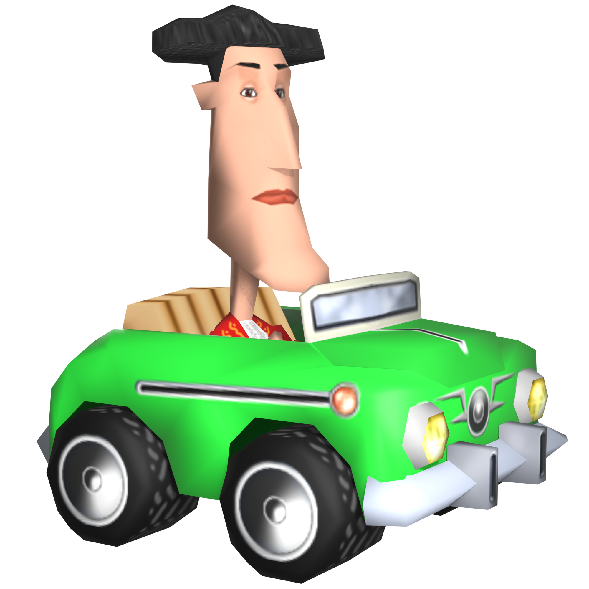

<p align="center">
  
</p>

<h1 align="center">ToonCar Viewer</h1>

<p align="center">
  Przeglądarkowa rekonstrukcja tras z gry <strong>ToonCar</strong>, renderowana w czasie rzeczywistym za pomocą Three.js.
</p>

<p align="center">
  <a href="https://tooncarviewer.netlify.app/track/venus">Uruchom wersję online</a>
</p>

## O projekcie

ToonCar Viewer pozwala swobodnie zwiedzać oryginalne trasy z gry w przeglądarce. Modele są eksportowane do GLB, a dodatkowe dane runtime odtwarzają elementy, których standard glTF nie przechowuje bezpośrednio: skyboxy z sześciu ścian oraz animowane tekstury.

Repozytorium zawiera również narzędzie do odczytu plików R3D gry, generowania scen Blendera i przygotowania assetów wykorzystywanych przez viewer.

## Dostępne trasy

- Wenus (`Venus`)
- Księżyc (`Luna`)
- Las Vegas (`Vegas`)
- Sahara (`Sahara`)
- Atol (`Atolon`)
- Amazonia (`Amazonia`)
- Kastylia (`Castilla`)
- Japonia (`Japon`)
- Alaska (`Alaska`)

Każda trasa ma własny model GLB, pozycję startową kamery, miniaturę, skybox i przypisany utwór z gry. Trasy zawierające animowane tekstury korzystają dodatkowo z atlasów i metadanych runtime.

## Funkcje

- renderowanie tras GLB w Three.js;
- materiały bez cieniowania, odpowiadające stylistyce oryginalnej gry;
- zapętlone i niezależne animacje transformacji meshów;
- animowane tekstury odtwarzane z atlasów z częstotliwością 55 Hz;
- osobny sześciostronny skybox dla każdej trasy;
- nawigacja freecam/noclip;
- wybór trasy zapisany w adresie URL;
- kopiowanie linku zawierającego dokładną pozycję, obrót i FOV kamery;
- reset kamery do pozycji startowej danej mapy;
- automatycznie dobierana i zapętlona muzyka trasy;
- interfejs desktopowy i osobne sterowanie dla urządzeń dotykowych;
- responsywna lista tras z oryginalnymi miniaturami;
- tryb pełnoekranowy na obsługiwanych urządzeniach.

## Sterowanie

### Komputer

| Wejście | Działanie |
| --- | --- |
| przeciągnięcie myszą | obrót kamery |
| `W` / `S` | lot do przodu / do tyłu zgodnie z kierunkiem patrzenia |
| `A` / `D` | lot w lewo / w prawo |
| `Q` / `E` | lot w dół / w górę |
| `Shift` | sprint, 2× aktualna prędkość |
| kółko myszy | zmiana bazowej prędkości lotu |

### Ekran dotykowy

- lewy joystick steruje ruchem;
- prawy joystick obraca kamerę;
- osobne przyciski zmieniają wysokość;
- siła wychylenia joysticka działa jak wejście analogowe;
- mobilny panel zapewnia wybór trasy, sterowanie muzyką, reset kamery i kopiowanie widoku.

## Technologie

- React
- TypeScript
- Three.js
- Tailwind CSS
- Vite
- React Router
- Blender
- Python

## Uruchomienie aplikacji

Wymagane są Node.js oraz pnpm.

```bash
pnpm install
pnpm dev
```

Serwer developerski działa na porcie `3000` i nasłuchuje na wszystkich interfejsach sieciowych:

```text
http://localhost:3000
http://<lokalne-ip-komputera>:3000
```

Pozostałe polecenia:

```bash
pnpm build    # sprawdzenie TypeScript i build produkcyjny
pnpm preview  # lokalny podgląd buildu
pnpm format   # formatowanie plików TS i TSX przez Prettier
```

## Format assetów trasy

Assety dostępne dla aplikacji znajdują się w `public/tracks/<id>/`. Typowy katalog zawiera:

```text
public/tracks/venus/
├── Venus.glb
├── thumbnail.jpg
├── runtime.json
├── skybox/
│   ├── skybox.json
│   ├── UP.png
│   ├── DN.png
│   ├── FR.png
│   ├── BK.png
│   ├── LF.png
│   └── RT.png
├── texture_animations.json
└── texture_animations/
    ├── anim_00_mat_011.json
    └── anim_00_mat_011.png
```

`runtime.json` wskazuje manifest animacji tekstur, manifest skyboxa i oczekiwany model GLB. Animacje transformacji są odtwarzane przez `THREE.AnimationMixer`, natomiast animacje tekstur korzystają z atlasów PNG i sekwencji klatek zapisanej w JSON.

Konfiguracja tras, ich kolejność, nazwy, muzyka i pozycje startowe kamery znajdują się w `src/tracks.ts`.

## Eksporter R3D

Plik `export_script/r3d_unpacker.pyw` zawiera rozwijany razem z projektem **ToonCar R3D Code-Guided Unpacker**. Narzędzie analizuje format R3D na podstawie zachowania oryginalnego loadera gry i potrafi między innymi:

- odczytywać tekstury, materiały, meshe i rozmieszczenie obiektów;
- odzyskiwać animowane obiekty oraz ich transformacje;
- przygotowywać atlasy animowanych tekstur i metadane czasu;
- wykrywać i eksportować sześć ścian skyboxa;
- generować scenę `.blend` z profilami materiałów do gry, podglądu realistycznego lub glTF;
- przygotowywać zewnętrzne assety runtime dla aplikacji Three.js;
- zachowywać surowe dane diagnostyczne pomocne przy dalszym reverse engineeringu.

Uruchomienie bez argumentów otwiera interfejs graficzny:

```bash
python export_script/r3d_unpacker.pyw
```

Narzędzie ma również interfejs CLI:

```bash
python export_script/r3d_unpacker.pyw "C:\path\to\Venus.r3d" --out "C:\temp\venus-export" --blender "C:\Program Files\Blender Foundation\Blender\blender.exe" --material-profile gltf
```

Pełna lista opcji:

```bash
python export_script/r3d_unpacker.pyw --help
```

Aktualny stan reverse engineeringu, potwierdzone layouty, używane heurystyki i lista nierozpoznanych struktur znajdują się w [`docs/r3d-format.md`](docs/r3d-format.md).

## Rekonstrukcja ikony

Katalog `icon_recreation/` zawiera:

- `ToonCar Icon.blend` — scenę Blendera z rekonstrukcją samochodu i kierowcy;
- `icon.png` — render źródłowy dla favicony i grafiki loadera aplikacji.

## Struktura projektu

```text
src/
├── components/       # interfejs, sidebar, jukebox i sterowanie viewerem
├── hooks/            # logika audio, ładowania i sceny Three.js
├── lib/three/        # animacje, materiały i obsługa assetów runtime
├── pages/            # strony routingu
└── tracks.ts         # definicje tras

public/
├── tracks/           # modele i assety runtime tras
└── music/            # muzyka poziomów

export_script/        # ekstrakcja R3D i eksport do Blendera/Three.js
icon_recreation/      # źródłowa scena oraz render ikony
```

## Informacja prawna

Projekt jest nieoficjalną inicjatywą fanowską służącą zachowaniu i analizie technicznej gry. Nie jest powiązany z jej twórcami ani wydawcami. Prawa do nazwy ToonCar oraz oryginalnych assetów należą do ich odpowiednich właścicieli. Do samodzielnego eksportu danych należy używać legalnie posiadanej kopii gry.
